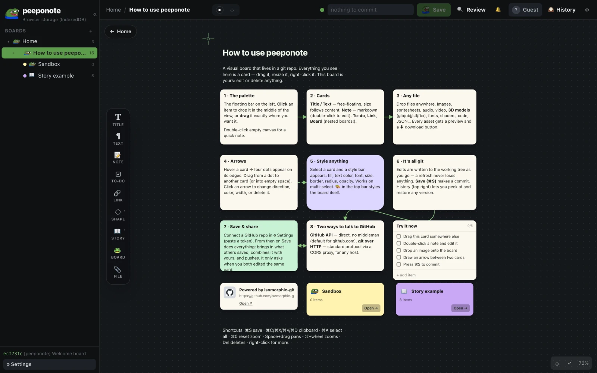
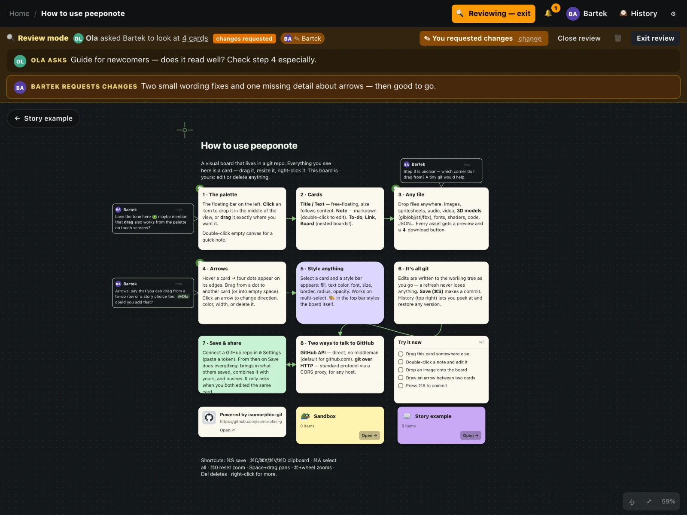
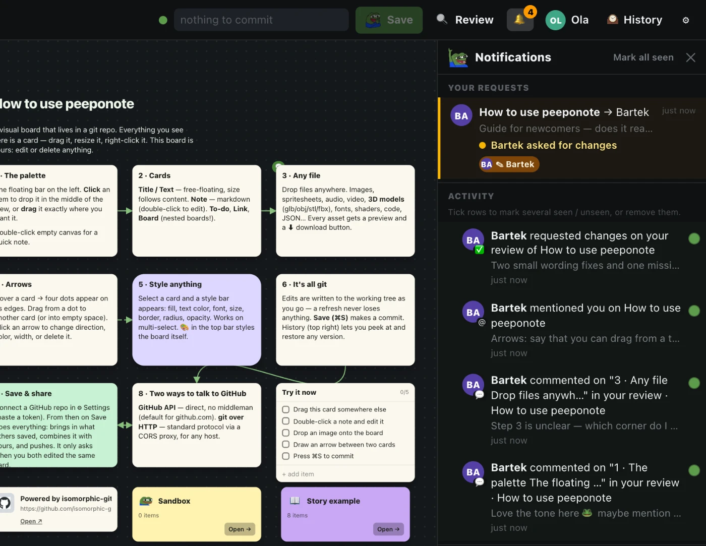
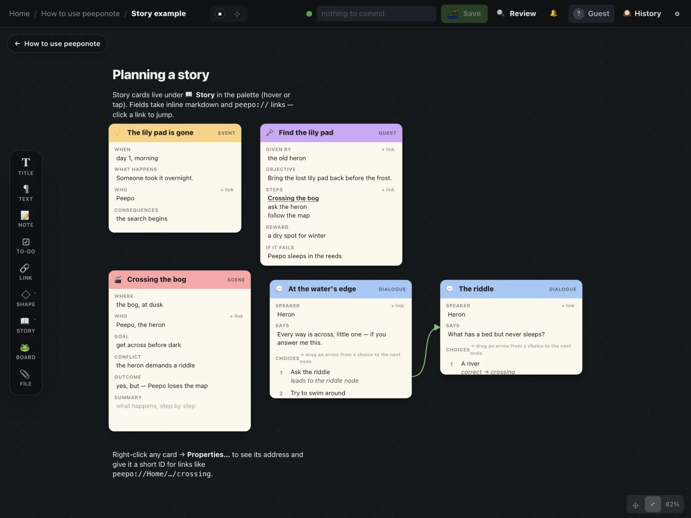

# peeponote 🐸

**→ [mikolajpochec.github.io/peeponote](https://mikolajpochec.github.io/peeponote/)**

Visual boards on an infinite canvas where **Save = `git commit`** (and push). A static web app / PWA — your repo is the backend.



## What it does

- **Cards of every kind** — text, markdown notes, to-dos, links, shapes, nested boards and **any file** with a live preview (images, audio, video, 3D models, fonts, code). Arrows between anything, styling, grouping, alignment. Works on phones.
- **It's all git** — plain JSON in `boards/`, files in `assets/`, in the browser (IndexedDB) or a real folder. Diff it, branch it, merge it. Drops into any repo (even a monorepo subfolder).
- **Save & share** — connect a GitHub repo with a token (or any git host through the CORS proxy): Save commits, pulls what others did, merges card-by-card and pushes. It only asks when you both edited the same card. Nothing is ever lost between saves — even text you're still typing survives a crash or a power cut.
- **Review without GitHub** — select cards, ask people for a review, comment in **🔍 Review** mode with bubbles that point at what they mean, approve or request changes, `@mention` anyone. It's all files under `review/`, signed with a key derived from your password, auto-committed and merged without conflicts — and the 🔔 notifications come straight from the repo.
- **Story planning** — dialogue nodes with choices, scenes, quests and events, linked with `peepo://` addresses and arrows.
- **For Claude and the terminal** — `cli/peepo.mjs` prints boards as markdown (`tree`, `show`, `search`, `graph --mermaid`); `cli/SKILL.md` makes it a Claude Code skill.







## Develop

```sh
bun install && bun dev        # http://localhost:5173
bun run build                 # → dist/, deployed to GitHub Pages on push to main
bun scripts/fetch-peepos.ts   # refresh peepo emotes from 7TV
```

Peepos from [7TV](https://7tv.app) · git in the browser by [isomorphic-git](https://isomorphic-git.org)
